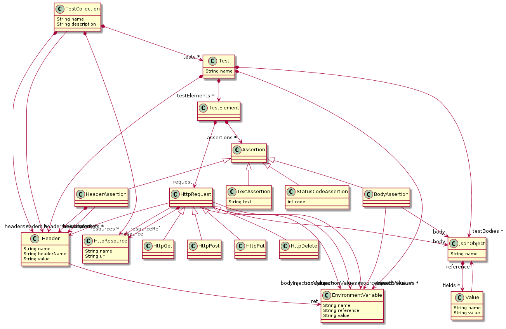

# HTTP REST test DSL

This is a project which explores the modelling and code generation functionality of [Xtext](https://www.eclipse.org/Xtext/), resulting in Eclipse DSL plugin which generates [JUnit](https://junit.org/junit5/) tests, as HTTP calls for testing REST API's.

The DSL makes it possible to write [this](./xtext.http.rest.testsuite.example/src/CompleteExample.testsuite) and get [this](./xtext.http.rest.testsuite.example/src-gen/CompleteExample.java), to e.g. test [this](https://github.com/jonev/mock-api).

## Use the DSL

### Prerequisites:

- Eclipse IDE for Java and DSL Developers ([download link](https://www.eclipse.org/downloads/packages/)).

### Step by step guide

1. Clone the repo
2. Open Eclipse and select the folder as workspace and use `Import projects...` in the Package Explorer, then select `General/Existing Projects into Workspace` to import the modules.
3. Run this file `./xtext.http.rest.testsuite/src/xtext/http/rest/TestSuite.xtext` with `Generate Xtext Artifacts` (Proceed with errors)
4. Select the root project `xtext.http.rest.testsuite` and use the run -> run as -> Eclipse application, this will open a new instance of Eclipse with the DSL plugin installed.
5. Use the new instance and import `./xtext.http.rest.testsuite.example`
6. Open `./src/CompleteExample.testsuite` this is an example of the features implemented in the DSL
7. When you edit and save this file, a java file will be generated `./src-gen/CompleteExample.java` containing JUnit tests  
   If there are missing packages, follow these steps:
8. Add JUnit 5 library to the project with: Project -> Properties -> Java Build Path -> Libraries -> Add Library
9. Add all external jars from `./externalJars` with: Project -> Properties -> Java Build Path -> Libraries -> Add External JARS
10. Run `.src-get/CompleteExample.java` as `JUnit 5 test`, this will run the generated JUnit tests

### Mock-API

For the JUnit tests to succeed, there have to be a REST API which responds to the request. For the `CompleteExample` a mock API can be found [here](https://github.com/jonev/mock-api).

## Repository overview

- xtext.http.rest.testsuite: Implementation of the DSL
  - Definition of the syntax [here](./xtext.http.rest.testsuite/src/xtext/http/rest/TestSuite.xtext)
  - Code generator [here](./xtext.http.rest.testsuite/src/xtext/http/rest/generator/TestSuiteGenerator.xtend)
  - Syntax validation [here](./xtext.http.rest.testsuite/src/xtext/http/rest/validation/TestSuiteValidator.java)
  - Generated data model [here](./xtext.http.rest.testsuite/model/generated/TestSuite.ecore)
- xtext.http.rest.testsuite.example: Example usage of the DSL
  - Example [here](./xtext.http.rest.testsuite.example/src/CompleteExample.testsuite)
  - Generated java code containing JUnit tests [here](./xtext.http.rest.testsuite.example/src-gen/CompleteExample.java)
- xtext.http.rest.testsuite.ide: IDE related code generated by Eclipse
- xtext.http.rest.testsuite.test: JUnit tests for the DSL implementation
  - JUnit tests [here](./xtext.http.rest.testsuite.tests/src/xtext/http/rest/tests/TestSuiteParsingTest.xtend)
- xtext.http.rest.testsuite.ui: UI related code
  - Quick fixes [here](./xtext.http.rest.testsuite.ui/src/xtext/http/rest/ui/quickfix/TestSuiteQuickfixProvider.java)
- xtext.http.rest.testsuite.ui.tests: UI test related code generated by Eclipse

## The DSL's features related to HTTP requests and assertions

- Global Resources: Define a resource once, use it in multiple tests
- Global Headers: Define a header once, use it in multiple tests
- Headers included in every test: Globally defined headers which will be present in every request
- Define multiple tests, where each test consist of:
  - Environment: Define variables, objects or headers related to the test
  - GET/POST/PUT/DELETE requests
    - Add body to the request
    - Inject variables into the resource url
    - Save values from the response body to a variable
  - Assertions of test response
    - Status code
    - Body, with possibility to inject an variable into the body
    - Text
    - Headers

For more details of what's possible see the [example.](./xtext.http.rest.testsuite.example/src/CompleteExample.testsuite)

## Data model

An overview of the DSL's data model, generated with [PlantUML](https://plantuml.com/):

